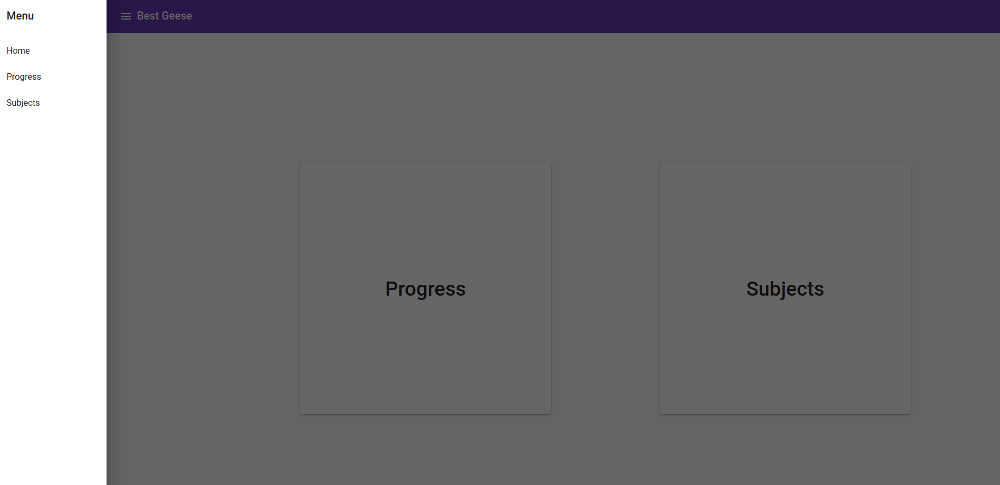
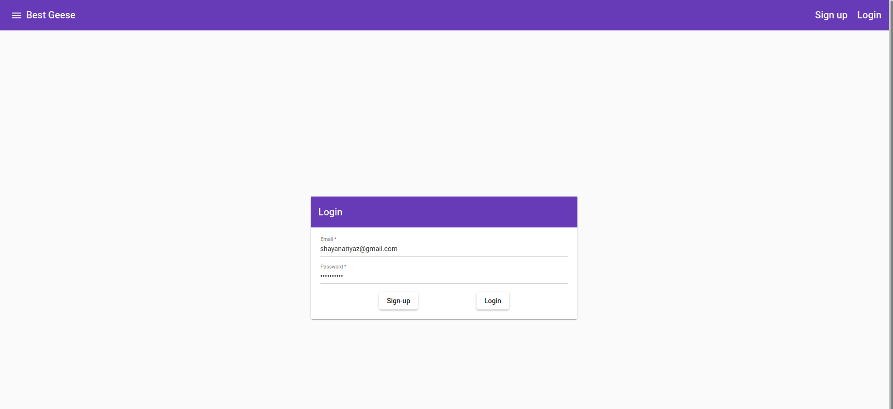
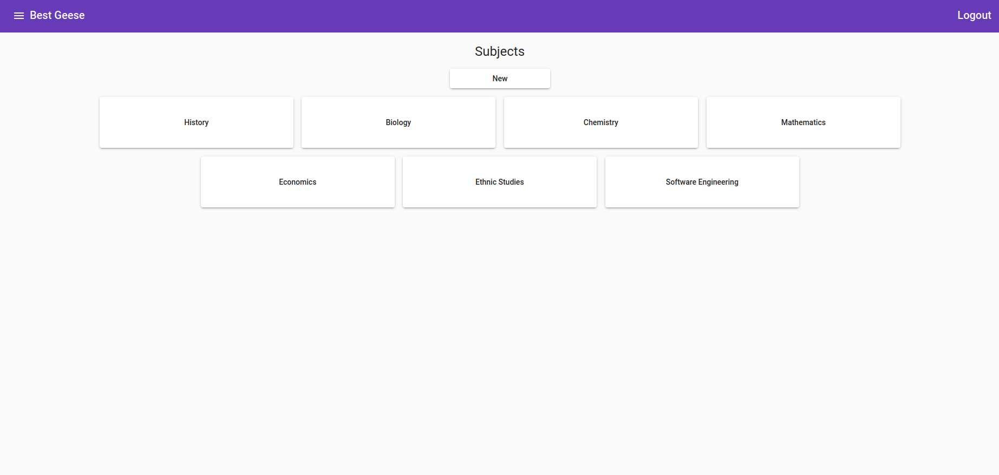
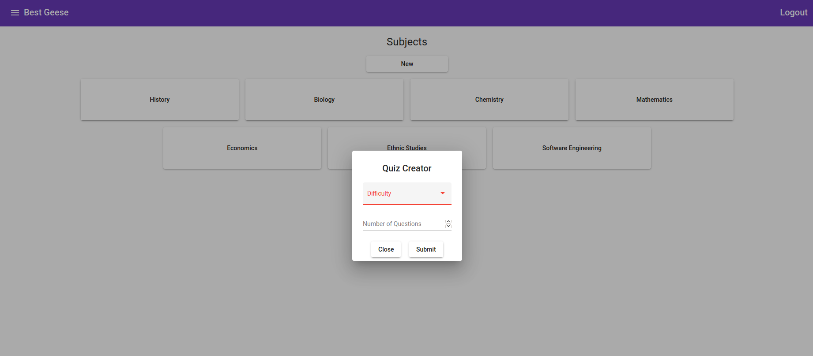
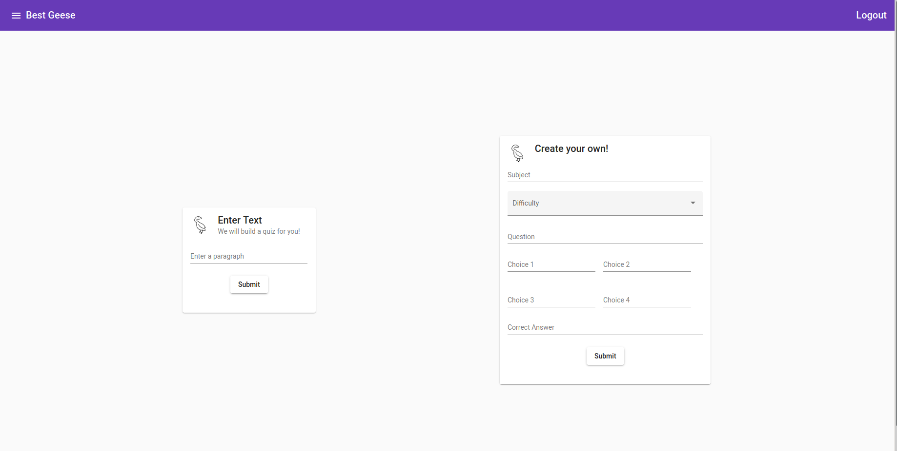

# 
Best-Geese

*
Education game for the silly geeses.
*

  
  

> ### Best Geese - A quiz app
> An application for students to self quiz and assess gaps in their knowledge and the areas of the subject they need to practice.

## About

### Minimum Viable Product:

Students can request a quiz based on subject tags and number of questions they would like in each subject. Each student can input their own questions they'd like to include in the quiz.

The View Progress function allows students to view their past history of attempting questions, and compare against a general attempt rate per question type.

## Site

Short walkthrough with accompanying screenshots here

Home|Login|Quiz|Quiz Type | Create Quiz |
|:-:|:---:|:--:|:--------:|:-----------:|
|  |  |  |  |

## How to run

### Frontend
1. Install node.js
2. `cd frontend`
3. `npm install @angular/cli`
4. `ng serve`
5. Navigate to `http://localhost:4200/`

### Backend
1. `cd backend`.
2. `sh init.sh`.
3. Navigate to `http://127.0.0.1:5000/` to view the backend.

## Contributors

Front-end services and UX: Gerald Marquez & David Knox

Database and backend services: Shayan Riyaz

1. `cd backend`
2. `sh init.sh`
3. Navigate to `http://127.0.0.1:5000/` to view the backend

## Built with 

 
 
 

|Langauge | Framework | Component|
|-|-|-|
|TypeScript|[Angular.js](https://angularjs.org/) | Frontend|
|Python|[Flask](https://flask.palletsprojects.com/en/1.1.x/) |Backend |
|Python|[MongoDB](https://www.mongodb.com/python) | Database|
|Python|[spacy](https://spacy.io/)| Aritifical Intelligence|

## To-do

## Contributors

## Team
| David Knox | Gerald Marquez | Shayan Riyaz |
| :----: | :---: | :---: |
|  [🌍](https://davidaknox.com/) [💻](https://github.com/knoxd8256) [🤝](https://linkedin.com/in/david-knox-developer) |  [🌍](https://www.linkedin.com/in/gerald-marquez/) [💻](https://github.com/gprmarquez) [🤝](gprmarquez.github.io) |  [🌍](https://shayanriyaz.github.io) [💻](https://github.com/ShayanRiyaz) [🤝](https://www.linkedin.com/in/shayan-riyaz/)|

**Front-end services and UX:** Gerald Marquez & David Knox

**Database and backend services:** Shayan Riyaz

## License
You can read the MIT License [here](https://github.com/MLH-Fellowship/Best-Geese/blob/main/LICENSE).